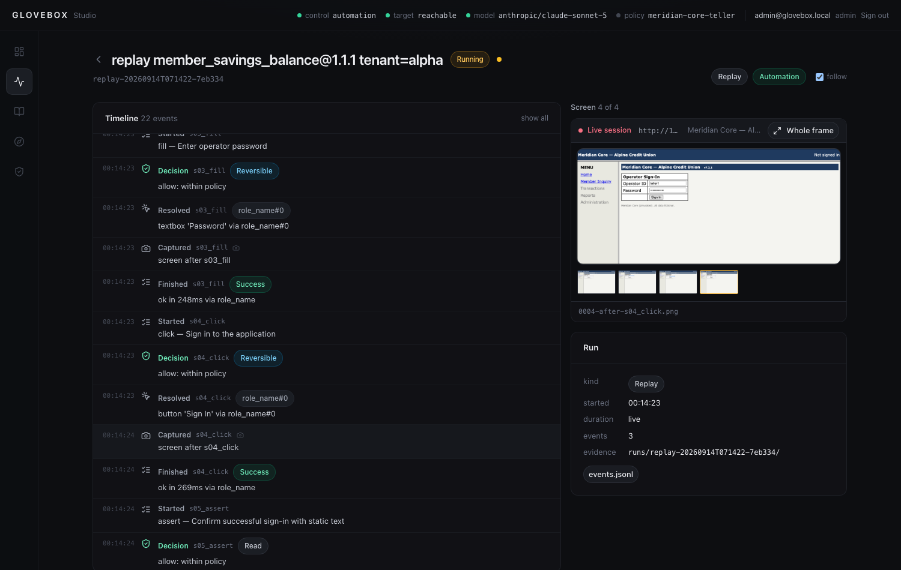
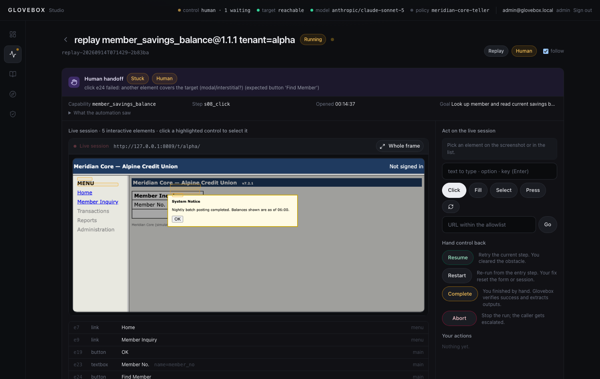

# Glovebox

**Computer-use automation for legacy back-office applications.** One LLM-driven discovery run
becomes a typed, reviewable, deterministic capability that AI agents invoke in production
without a model in the loop — inside an allowlist, with redacted evidence, and with a real
path for a human to take over the live session and hand it back.

> A glovebox is how you handle hazardous material safely: through a sealed barrier, with full
> visibility. That is the design brief here — regulated bank software, operated by agents,
> only through a controlled, observable layer.

```
goal ──▶ discovery (Claude drives the real UI) ──▶ capability.json (typed contract + steps)
                                                        │  human review → approved
production:  agent ──▶ replay(capability, params) ──▶ success{outputs} | business_outcome{code} | escalated | failed{step, expected, observed, evidence}
                                   │ stuck / irreversible step
                                   └──▶ human takes over the same live session ──▶ hands back
```

| Requirement (brief §3) | Where |
|---|---|
| 3.1 Goal-driven agent loop on a real UI | `src/glovebox/agent/loop.py`, surface in `src/glovebox/surface/` |
| 3.2 Structured, typed, versioned artifact | `src/glovebox/schema/capability.py` (+ `glovebox schema` for JSON Schema) |
| 3.3 Deterministic replay, error taxonomy, result contract | `src/glovebox/replay/engine.py`, `src/glovebox/schema/results.py` |
| 3.4 Allowlist, risk classes, redaction | `policies/default.yaml`, `src/glovebox/policy/`, `src/glovebox/evidence/redaction.py` |
| 3.5 Evidence | `runs/<run_id>/` → `evidence/` (events.jsonl, screenshots, DOM snapshots, trace) |
| 3.6 Human escalation & handoff on the live session | `src/glovebox/control/` (lease model, bridge), Studio takeover panel |
| 3.7 Heterogeneity & multi-tenant | `Surface` protocol, `TenantOverride` in the schema, [Glovebox-Design-Writeup.md §4](./Glovebox-Design-Writeup.md) |
| Stretch: agent-facing catalog, stability, cross-tenant | `src/glovebox/catalog/`, `glovebox stability`, `evidence/replay-tenant-bravo-override/` |

Design write-up: **[Glovebox-Design-Writeup.md](./Glovebox-Design-Writeup.md)**. Decisions: [docs/adr/](./docs/adr/). Evidence: [evidence/](./evidence/).

## The target: Meridian Core

We are not given a bank system, so the repo ships one that is *hostile in the ways that
matter*: `apps/legacy_bank/` is a server-rendered frameset app (nav / menu / main frames),
table layouts, `<font>` tags, no ids or test ids, form fields identified only by visible
labels in adjacent table cells, a JavaScript `confirm()` before a mutating submit, and two
"tenants" (`/t/alpha/`, `/t/bravo/`) that run the same product with different branding,
labels and an extra post-login notice. A **fault injector** arms one-shot runtime conditions —
`session_expired`, `permission_denied`, `app_error` (HTTP 500), `slow`, `interstitial` modal,
`validation` — so replay error handling is demonstrated against real failures rather than
described. All data is fictional; credentials are fake.

## Glovebox Studio

The workspace for engineers and operators: `make studio` → http://127.0.0.1:8800/.

**Signing in.** Studio has its own accounts, separate from the application it drives. `.env`
carries an administrator, so a fresh clone can sign straight in:

| | |
|---|---|
| Email | `admin@glovebox.local` |
| Password | `glovebox-admin-2026` |

`GLOVEBOX_STUDIO_EMAIL` / `GLOVEBOX_STUDIO_PASSWORD` seed that account the first time Studio
starts against an empty database, and seeding is refused once any account exists — so it is a way
in on a clean checkout, never a way back to admin on a live one. Comment the two variables out and
the sign-up form takes over, where **the first account created becomes the administrator** and
later ones are viewers until an administrator raises them. Passwords are at least 12 characters.
Accounts live in `runs/studio.db` (gitignored) — delete that file to start over.

`GLOVEBOX_APP_USERNAME` / `GLOVEBOX_APP_PASSWORD` (`teller1` / `teller1-pass`) are **not** Studio
credentials: they are the fake bank's operator login, which replay uses to sign into Meridian
Core. The Studio email field expects an email address, so `teller1` is rejected there.

> **On scope.** The brief puts a full operator console out of scope and says to mock the UI
> so long as the handoff mechanism and control-transfer model are real. I went past that
> deliberately, and it is the one place in this repository where I did. The reason is that
> the control model is the hardest thing here to believe from a description: that a human
> takes over the *same* live session rather than a fresh one, that the automation thread stays
> alive serving them, and that who holds the lease is answerable at every instant. Screenshots
> of a real takeover argue that better than prose. Nothing in the UI can do what the CLI
> cannot — both drive the same `OperatorBridge` verbs — so it is a window onto the mechanism,
> not a second implementation of it. Sign-in and roles came with it for a narrower reason
> given in Glovebox-Design-Writeup.md §5: an operator name the browser types is not an audit trail. If you are
> weighing effort, the load-bearing work is in `agent/`, `replay/`, `schema/` and `surface/`.

<p align="center"></p>

- **Runs** — every discovery and replay, live. Model decisions, actions, policy verdicts,
  locator resolutions, conditions, recoveries and control transfers stream in beside the
  screenshot of that moment. Result contract, outputs, failure detail and evidence files on the right.
- **Capabilities** — the catalog as a reviewer sees it: contract, every step with its ranked
  locator strategies and robustness notes, outcomes, recoveries, provenance. Approve for
  unattended replay, or invoke with parameters, a tenant override and an injected fault.
- **Discover** — give the model a goal and watch it work inside policy.
- **Takeover** — when a run is stuck, needs approval for an irreversible step, or is blocked,
  the takeover panel appears on the run page: the *same* browser session with clickable
  hotspots on every control, why it stopped, what the automation saw, and six ways to hand
  control back. Every human action is recorded with the recorder's own locator description.

<p align="center"></p>

The UI is a React + Tailwind single-page app (`ui/`), built assets are committed under
`src/glovebox/studio/static` so Python is the only runtime dependency. A bare HTML console
(`glovebox replay --console-port`) remains for headless/CLI use; both are clients of the same
`OperatorBridge`.

## Setup

Requirements: Python ≥ 3.11, [uv](https://docs.astral.sh/uv/), Chromium via Playwright.

```bash
git clone https://github.com/Saivineeth147/glovebox && cd glovebox
make setup                      # uv sync + playwright chromium
cp .env.example .env            # a model key is only needed for a live discovery run
```

Every CLI command loads `.env` from the repo root before it runs. A variable already
exported in your shell wins over the file, so a CI secret is never shadowed by a stale
checkout.

Everything except a live discovery run works **offline**: the target app, replay, error
injection, handoff, tests and evidence generation need no key and no network.

## Demo path

Terminal 1 — the legacy app:

```bash
make target                     # http://127.0.0.1:8089/  (tenants /t/alpha/, /t/bravo/)
```

Terminal 2 — discovery (real LLM), then deterministic replay:

```bash
export ANTHROPIC_API_KEY=sk-ant-...            # or OPENROUTER_API_KEY=sk-or-..., or put either in .env
uv run glovebox discover \
  --goal "Look up member 100234 and read their current savings balance" \
  --app-url http://127.0.0.1:8089/ --capability-name member_savings_balance \
  --param member_id=100234 --evidence-dir evidence/discovery
# → capabilities/member_savings_balance.json (status: draft), operator console on :8790

uv run glovebox catalog approve member_savings_balance you   # reviewer name; gate for unattended replay

uv run glovebox replay member_savings_balance --param member_id=100235   # different input, no model
uv run glovebox replay member_savings_balance --param member_id=999999   # → business_outcome MEMBER_NOT_FOUND
uv run glovebox replay member_savings_balance --param member_id=100234 --fault app_error          # → failed + evidence
uv run glovebox replay member_savings_balance --param member_id=100234 --fault session_expired    # → recovered
uv run glovebox replay member_savings_balance --param member_id=100234 --fault interstitial \
      --attended --console-port 8790     # stuck → open http://127.0.0.1:8790, click OK, "resume"
```

**Model providers.** Discovery is the only step that calls a model. Anthropic direct
(`ANTHROPIC_API_KEY`, default `claude-sonnet-5`, adaptive thinking + prompt caching; `claude-opus-5` for the hardest flows) or any
OpenAI-compatible endpoint with tool calling — OpenRouter out of the box
(`OPENROUTER_API_KEY`; default `anthropic/claude-sonnet-5`; also `anthropic/claude-opus-5`,
`openai/gpt-5.6-sol`, `openai/gpt-5.6-luna`, `google/gemini-3.8-flash` — any vision + tool-calling model;
`--provider openrouter` or `GLOVEBOX_LLM_PROVIDER`). A discovery run on Sonnet 5 costs well
under a dollar. The artifact and the evidence are
identical in shape whichever provider recorded them; replay never needs a key.

Operator credentials for the fake app come from `GLOVEBOX_APP_USERNAME` / `GLOVEBOX_APP_PASSWORD`
(defaults `teller1` / `teller1-pass`); they are sensitive parameters — substituted at run time,
never shown to the model, never written to artifacts or logs.

No key? Run the same loop with scripted decisions to see the artifact path end to end:

```bash
uv run glovebox discover --goal "..." --app-url http://127.0.0.1:8089/ \
  --capability-name member_savings_balance --param member_id=100234 --offline-script member_savings_balance
```

Or do all of it from the UI: `make studio`.

Other commands: `glovebox catalog list|tools` (the catalog as Claude tool definitions),
`glovebox stability <cap> --runs 5`, `glovebox validate <cap.json>`, `glovebox schema`.

## The surface seam, tested

`Surface` is the only place that knows how a screen is reached. The artifact is supposed to
describe what an operator perceives — role, name, label, a cell at a row and column — rather
than what Playwright does. `surface/http/` is that claim under test: a second surface with no
DOM, no JavaScript and no layout engine, which fetches pages and submits forms the way a
terminal-era client would, and resolves recorded targets through the same `locators` module.

The **same reviewed capability**, recorded through a browser, replays through it:

```
playwright (browser)    2.80s  success  {'savings_balance': 1250.75}
http (no browser)       0.03s  success  {'savings_balance': 1250.75}
```

What it cannot do is as useful as what it can. There is no geometry, so a `bbox` strategy
simply fails and `near_text` refuses rather than ranking candidates that all sit at the origin —
writing this surface is what exposed that `near_text` would otherwise return a confidently
wrong element whenever layout is unavailable. `table_cell` survives because a cell named by its
row anchor and column header does not depend on being rendered, which is the same property
that let it survive column reordering in the drift evaluation.

The production second surface is Windows UI Automation, which reports the same role/name/label
vocabulary. This one is what could be built and tested here, and it proves the seam with code.

## Resilience, measured

The artifact stores several ordered locator strategies per target because which one survives a
UI change is unknowable at record time. That is an argument; `glovebox drift` turns it into a
number. The target app rewrites its own rendered pages the way a redesign would — renaming the
search control, renaming the member field, swapping two table columns, wrapping every table,
inserting a table ahead of the content — and the same approved capability is replayed against
each.

```bash
make target        # terminal 1
make drift         # terminal 2
```

```
member_savings_balance: survival under redesign
redesign              outcome   rescued by
rename_action         survived  s08_click: role_name → css
rename_label          survived  s07_fill:  role_name → name_attr
reorder_columns       survived  —
wrap_tables           survived  —
insert_leading_table  survived  —

member_status: survival under redesign
rename_action         survived  s07_click: role_name → css
rename_label          survived  s06_fill:  role_name → name_attr
...

survived 100% of 10 redesigns across 2 capabilities
```

With no capability named it evaluates the whole approved catalog and exits non-zero if any
redesign stops being survived, so CI holds the line: a change that quietly narrows the
locator ladder fails the build rather than surfacing in production.

The last column is the point: it names the rung of the ladder that caught the fall. Swapping
columns needs no fallback at all, because `table_cell` addresses a cell by its column header
rather than its position — the reason that strategy exists.

Mutations are presentation-only and leave the app working; a frameset page is left alone,
because inserting anything around a frameset stops the frames loading and would measure the
mutation rather than the capability.

## Tests

```bash
make test        # unit + browser integration (headless Chromium against the simulated app, ~2 min)
make ui-test     # frontend unit tests (vitest + jsdom)
make drift       # every approved capability under every simulated redesign
make lint        # ruff + mypy --strict
make evidence    # regenerate evidence/replay-* bundles offline
```

The integration suite drives real discovery (scripted decisions), replay with different inputs,
every injected fault, the handoff with a scripted human *and* through the HTTP operator console,
the irreversible-step approval flow, the draft gate, policy violations and the cross-tenant
override. It also replays the committed capability through the browser-free surface, resumes a
replay into a warm session with no credentials, and drives assisted repair under a live
redesign. The frontend has its own suite over formatting, the status vocabulary and the whole
sign-in flow. CI runs all of it, plus the drift gate, on every push.

## Reusing a session

Each replay signing in again is the obvious waste, and credentials in the main flow are the
less obvious one. A caller can hand `run_replay` a surface it owns — not closed when the run
ends — and resume a later replay at a named step:

```python
warm = HtmlSurface(app_url)
run_replay(cap, {"member_id": "100234", **credentials}, policy, surface=warm)
run_replay(
    cap,
    {"member_id": "100235"},
    policy,
    surface=warm,
    start_at=cap.steps[len(session_prefix(cap))].id,
)  # no credentials at all
```

`session_prefix()` finds the steps that exist only to sign in by following the sensitive
parameters, and required-input validation narrows to what the remaining steps actually
substitute — so the second call is not merely spared the sign-in, it is refused the
credentials.

## Project layout

```
src/glovebox/
  schema/      capability artifact, result contract, events, policy   ← the contracts
  surface/     Surface protocol + Playwright implementation, perception walker, locator strategies
  agent/       discovery loop, tool definitions, recorder (transcript → artifact), model clients
  replay/      deterministic engine, input validation, templating
  policy/      allowlist + risk-class guardrails
  control/     control lease, operator bridge, scripted operator, minimal console
  evidence/    run directory, redacted JSONL logger
  catalog/     capability registry → agent tool definitions
  studio/      the workspace UI's API: accounts, roles, jobs, live run stream, takeover
  cli.py       typer CLI · runner.py wiring · drift_eval.py the redesign sweep
               repair.py the bounded repair proposal · textmatch.py one definition of
               "that text is on screen", shared by the recorder and every surface
apps/legacy_bank/   Meridian Core: the hostile simulated target with fault injection
capabilities/       committed artifacts (reviewable JSON)
evidence/           discovery + replay evidence bundles (see evidence/README.md)
policies/           guardrail policy (YAML)
docs/adr/           architecture decision records
tests/              unit + integration
```

## What is mocked, and why

- **Operator console** — a bare HTML/JSON client of the real control bridge. The lease model,
  same-session control, action recording and hand-back are real; the UI is intentionally minimal.
- **Target application** — a simulation. It is *more* hostile than most demo sites and lets us
  inject runtime faults deterministically, which a public site cannot.
- **Desktop / accessibility surfaces** — not implemented; the `Surface` protocol and the
  artifact vocabulary are designed for them (Glovebox-Design-Writeup.md §4).

## License

MIT.
