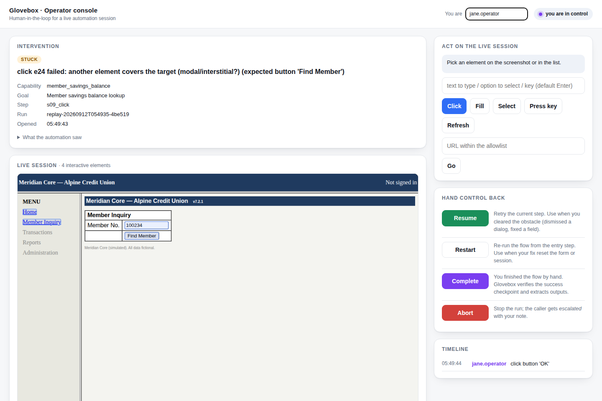

# Glovebox

**Computer-use automation for legacy back-office applications.** One LLM-driven discovery run
becomes a typed, reviewable, deterministic capability that AI agents invoke in production
without a model in the loop — inside an allowlist, with redacted evidence, and with a real
path for a human to take over the live session and hand it back.

> A glovebox is how you handle hazardous material safely: through a sealed barrier, with full
> visibility. That is the design brief here — regulated bank software, operated by agents,
> only through a controlled, observable layer.

```
goal ──▶ discovery (Claude drives the real UI) ──▶ capability.json (typed contract + steps)
                                                        │  human review → approved
production:  agent ──▶ replay(capability, params) ──▶ success{outputs} | business_outcome{code} | escalated | failed{step, expected, observed, evidence}
                                   │ stuck / irreversible step
                                   └──▶ human takes over the same live session ──▶ hands back
```

| Requirement (brief §3) | Where |
|---|---|
| 3.1 Goal-driven agent loop on a real UI | `src/glovebox/agent/loop.py`, surface in `src/glovebox/surface/` |
| 3.2 Structured, typed, versioned artifact | `src/glovebox/schema/capability.py` (+ `glovebox schema` for JSON Schema) |
| 3.3 Deterministic replay, error taxonomy, result contract | `src/glovebox/replay/engine.py`, `src/glovebox/schema/results.py` |
| 3.4 Allowlist, risk classes, redaction | `policies/default.yaml`, `src/glovebox/policy/`, `src/glovebox/evidence/redaction.py` |
| 3.5 Evidence | `runs/<run_id>/` → `evidence/` (events.jsonl, screenshots, DOM snapshots, trace) |
| 3.6 Human escalation & handoff on the live session | `src/glovebox/control/` (lease model, bridge, console) |
| 3.7 Heterogeneity & multi-tenant | `Surface` protocol, `TenantOverride` in the schema, [REPORT.md §4](./REPORT.md) |
| Stretch: agent-facing catalog, stability, cross-tenant | `src/glovebox/catalog/`, `glovebox stability`, `evidence/replay-tenant-bravo-override/` |

Design write-up: **[REPORT.md](./REPORT.md)**. Decisions: [docs/adr/](./docs/adr/). Evidence: [evidence/](./evidence/).

## The target: Meridian Core

We are not given a bank system, so the repo ships one that is *hostile in the ways that
matter*: `apps/legacy_bank/` is a server-rendered frameset app (nav / menu / main frames),
table layouts, `<font>` tags, no ids or test ids, form fields identified only by visible
labels in adjacent table cells, a JavaScript `confirm()` before a mutating submit, and two
"tenants" (`/t/alpha/`, `/t/bravo/`) that run the same product with different branding,
labels and an extra post-login notice. A **fault injector** arms one-shot runtime conditions —
`session_expired`, `permission_denied`, `app_error` (HTTP 500), `slow`, `interstitial` modal,
`validation` — so replay error handling is demonstrated against real failures rather than
described. All data is fictional; credentials are fake.

## The operator console

When automation is stuck, needs approval for an irreversible step, or a policy blocks it, the
run does not die: it raises an intervention and *serves* the human. The console shows the same
browser session with clickable hotspots on every control, the context of why it stopped, and
the six ways to hand control back. Every human action is recorded with the same locator
description the recorder uses.

<p align="center"></p>

## Setup

Requirements: Python ≥ 3.11, [uv](https://docs.astral.sh/uv/), Chromium via Playwright.

```bash
git clone https://github.com/Saivineeth147/glovebox && cd glovebox
make setup                      # uv sync + playwright chromium
cp .env.example .env            # ANTHROPIC_API_KEY only needed for a live discovery run
```

Everything except a live discovery run works **offline**: the target app, replay, error
injection, handoff, tests and evidence generation need no key and no network.

## Demo path

Terminal 1 — the legacy app:

```bash
make target                     # http://127.0.0.1:8089/  (tenants /t/alpha/, /t/bravo/)
```

Terminal 2 — discovery (real LLM), then deterministic replay:

```bash
export ANTHROPIC_API_KEY=sk-ant-...            # or put it in .env
uv run glovebox discover \
  --goal "Look up member 100234 and read their current savings balance" \
  --app-url http://127.0.0.1:8089/ --capability-name member_savings_balance \
  --param member_id=100234 --evidence-dir evidence/discovery
# → capabilities/member_savings_balance.json (status: draft), operator console on :8790

uv run glovebox catalog approve member_savings_balance --reviewer you   # gate for unattended replay

uv run glovebox replay member_savings_balance --param member_id=100235   # different input, no model
uv run glovebox replay member_savings_balance --param member_id=999999   # → business_outcome MEMBER_NOT_FOUND
uv run glovebox replay member_savings_balance --param member_id=100234 --fault app_error          # → failed + evidence
uv run glovebox replay member_savings_balance --param member_id=100234 --fault session_expired    # → recovered
uv run glovebox replay member_savings_balance --param member_id=100234 --fault interstitial \
      --attended --console-port 8790     # stuck → open http://127.0.0.1:8790, click OK, "resume"
```

Operator credentials for the fake app come from `GLOVEBOX_APP_USERNAME` / `GLOVEBOX_APP_PASSWORD`
(defaults `teller1` / `teller1-pass`); they are sensitive parameters — substituted at run time,
never shown to the model, never written to artifacts or logs.

No key? Run the same loop with scripted decisions to see the artifact path end to end:

```bash
uv run glovebox discover --goal "..." --app-url http://127.0.0.1:8089/ \
  --capability-name member_savings_balance --param member_id=100234 --offline-script member_savings_balance
```

Other commands: `glovebox catalog list|tools` (the catalog as Claude tool definitions),
`glovebox stability <cap> --runs 5`, `glovebox validate <cap.json>`, `glovebox schema`.

## Tests

```bash
make test        # unit + browser integration (headless Chromium against the simulated app, ~2 min)
make lint        # ruff + mypy --strict
make evidence    # regenerate evidence/replay-* bundles offline
```

The integration suite drives real discovery (scripted decisions), replay with different inputs,
every injected fault, the handoff with a scripted human *and* through the HTTP operator console,
the irreversible-step approval flow, the draft gate, policy violations and the cross-tenant
override. CI runs all of it on every push.

## Project layout

```
src/glovebox/
  schema/      capability artifact, result contract, events, policy   ← the contracts
  surface/     Surface protocol + Playwright implementation, perception walker, locator strategies
  agent/       discovery loop, tool definitions, recorder (transcript → artifact), model clients
  replay/      deterministic engine, input validation, templating
  policy/      allowlist + risk-class guardrails
  control/     control lease, operator bridge, scripted operator, minimal console
  evidence/    run directory, redacted JSONL logger
  catalog/     capability registry → agent tool definitions
  cli.py       typer CLI · runner.py wiring
apps/legacy_bank/   Meridian Core: the hostile simulated target with fault injection
capabilities/       committed artifacts (reviewable JSON)
evidence/           discovery + replay evidence bundles (see evidence/README.md)
policies/           guardrail policy (YAML)
docs/adr/           architecture decision records
tests/              unit + integration
```

## What is mocked, and why

- **Operator console** — a bare HTML/JSON client of the real control bridge. The lease model,
  same-session control, action recording and hand-back are real; the UI is intentionally minimal.
- **Target application** — a simulation. It is *more* hostile than most demo sites and lets us
  inject runtime faults deterministically, which a public site cannot.
- **Desktop / accessibility surfaces** — not implemented; the `Surface` protocol and the
  artifact vocabulary are designed for them (REPORT.md §4).

## License

MIT.
